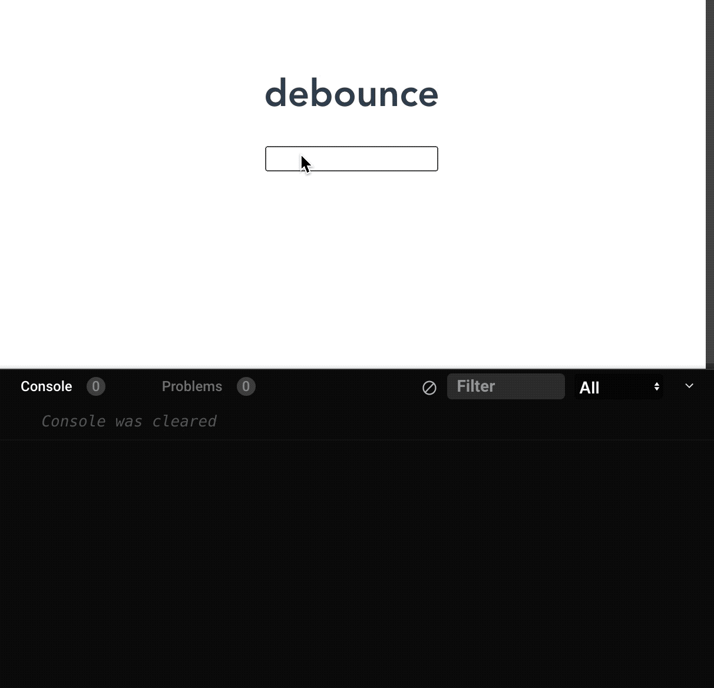
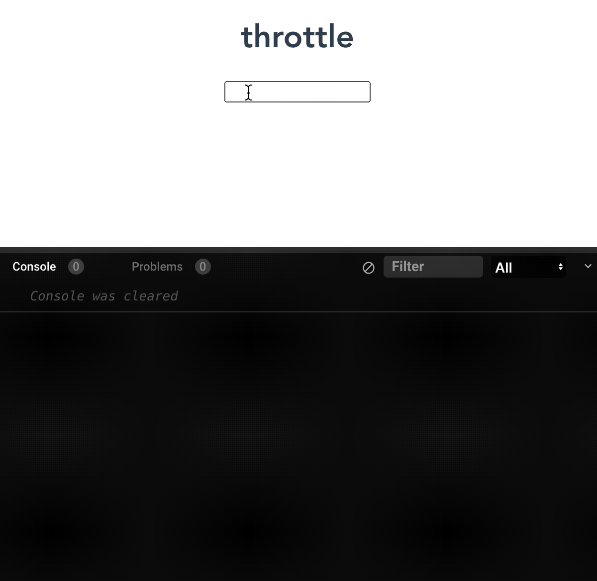

# ✋🏻手撸代码

## 1. 数据扁平化

将一个多维数组变为一个以为数组

```javascript
const arr = [1, [2, [3, [4, 5]]], 6]
// =>  [1, 2, 3, 4, 5, 6]
```

#### 方法一：使用 flat()

```javascript
const res1 = arr.flat(Infinity)
```

`Array.prototype.flat(depth)` 方法会按照一个可指定的深度（depth：默认值为 1）递归遍历数组，并将所有元素与遍历到的子数组中的元素合并为一个新数组返回。

#### 方法二：利用正则表达式

```javascript
const res2 = JSON.stringify(arr).replace(/\[|\]/g, '').split(',')
```

<u>注： 数组类型都会变为字符串类型</u>

#### 方法三：利用正则表达式（保持数据类型）

```javascript
const res3 = JSON.parse('[' + JSON.stringify(arr).replace(/\[|\]/g, '').split(',') +']') 
```

#### 方法四：使用 reduce

```javascript
const flatten = arr => {
  return arr.reduce((pre, cur) => {
    console.log('--pre--', pre)
    console.log('--cur--', cur)
    return pre.concat(Array.isArray(cur) ? flatten(cur) : cur)
  }, [])
}
const res4 = flatten(arr)
```

`Array.prototype.reduce()` 方法接收一个函数作为累加器，数组中的每个值（从左到右）开始缩减，最终计算为一个值。对空数组时不会执行回调函数。

#### 方法五：函数递归

```javascript
const res5 = []
const fn = arr => {
  for (let i = 0; i < arr.length; i++) {
    if (Array.isArray(arr[i])) {
      fn(arr[i])
    } else {
      res5.push(arr[i])
    }
  }
}
fn(arr)
```

## 2. 数组去重

数组去除重复元素

```javascript
const arr = [1, 1, '1', 2, 3, true, true, false, false, true, 'false', 'a', {}, {}]
// => [1, '1', 2, 3, true, false, 'false', 'a', {}, {}]
```

#### 方法一：利用 set

```javascript
const res1 = Arrat.from(new Set(arr))
// 函数式
const arrUnique1 = arr => [...new Set(arr)]
```

#### 方法二：两层 for 循环 + splice

```javascript
function arrUnique2 (arr) {
  let len = arr.length
  for (let i = 0; i < len; i++) {
    for (let j = i + 1; j < len; j++) {
      if (arr[i] === arr[j]) {
        arr.splice(j, 1)
        len--
        j--
      }
    }
  }
  return arr
}
```

#### 方法三：利用 for + indexOf

```javascript
function arrUnique3 (arr) {
  const res = []
  for (let i = 0; i < arr.length; i++) {
    if (res.indexOf(arr[i]) === -1) res.push(arr[i])
  }
  return res
}
```

`Array.prototype.indexOf()` 方法用于查找数组成员第一次出现指定字符的位置。

#### 方法四： 利用 include

```javascript
function arrUnique4 (arr) {
  const res = []
  for (let i = 0; i < arr.length; i++) {
    if (!res.includes(arr[i])) res.push(arr[i])
  }
  return res
}
```

`Array.prototype.includes()` 方法用于判断数组是否包含指定的值。

#### 方法五：利用 filter

```javascript
function arrUnique5 (arr) {
  return arr.filter((item, index) => {
    return arr.indexOf(item) === index
  })
}
```

`Array.prototype.filter()` 方法创建一个新数组，其包含通过所提供函数实现的测试的所有元素。

## 3. Debounce （防抖）

触发高频时间后 n 秒内函数只会执行一次，如果 n 秒内高频时间再次触发，则重新计算时间

```javascript
const debounce = (fn, time) => {
  let timeout = null
  return function () {
    clearTimeout(timeout)
    timeout = setTimeout(() => {
      fn.apply(this, arguments)
    }, time)
  }
}
```

vue 中实战：input 框实时搜索并发送请求展示下拉列表，在连续输入中途停顿时间不超过设定的时间，是不会发送请求，无规律发送（也可以做节流，规定多少时间发送一次请求，有规律发送） [demo](https://codesandbox.io/s/debounce-n7cw6l?file=/src/App.vue)

我们通过使用 观察者（watcher） 监听 `value` 数据属性 来实现了打印日志。但如果你想在 观察者的回调 中加入一个 使用 `value` 作为参数 的 GET 请求，那你应该不会期望太过频繁地发起请求。



```vue
<template>
  <div>
    <input v-model="str" />
  </div>
</template>

<script>
import debounce from '../utils/debounce'

export default {
  name: "HelloWorld",
  data(){
    return {
      str: ''
    }
  },
  watch: {
    str(...args) {
      this.debouncedWatch(...args)
    }
  },
  created () {
    this.debouncedWatch = debounce((newValue, oldValue) => {
      console.log("Value changed: ", newValue)
    }, 1000)
  }
};
</script>
```

## 4. throttle （节流）

高频时间触发，但 n 秒内只会执行一次，所以节流会稀释函数的执行频率

```javascript
const throttle = (fn, time) => {
  let flag = true
  return function () {
    if (!flag) return
    flag = false
    setTimeout(() => {
      fn.apply(this, arguments)
      flag = true
    }, time)
  }
}
```

Vue 中实战：规定在一个单位时间内，只能触发一次函数。如果这个单位时间内触发多次函数，只有一次生效。[demo](https://codesandbox.io/s/throttle-3p983f?file=/src/App.vue)



```vue
<template>
  <h1>throttle</h1>
  <input v-model="value" />
</template>

<script>
import throttle from './utils/throttle.js'

export default {
  name: "App",
  data() {
    return {
      value: ''
    }
  },
  created () {
    this.throttleWatch = throttle((newValue, oldValue) => {
      console.log('new value', newValue)
    }, 1000)
  },
  watch: {
    value (...args) {
      this.throttleWatch(...args)
    }
  }
};
</script>
```

**函数防抖是某一段时间内只执行一次，而函数节流是间隔时间执行。**

## 5. 浅拷贝


## 6. 深拷贝


## 7. 滚动加载

监听页面滚动事件，分析 clientHeight、scrollTop、scrollHeight 三者的属性关系

```javascript
window.addEventListener('scroll', function () {
  const clientHeight = document.documentElement.clientHeight
  const scrollTop = document.documentElement.scrollTop
  const scrollHeight = document.documentElement.scrollHeight
  
  if (clientHeight + scrollTop >= scrollHeight) {
    // 检测到滚动至页面底部，进行后续操作
  }
})
```

## 8. 渲染大数据不卡页面

渲染大数据时，合理使用 createDocumentFragment 和 requestAnimationFrame，将操作切分为一小段一小段执行

```javascript
setTimeout(() => {
  // 数据总数
  const total = 100000
  // 一次加入的数据
  const once = 20
  // 插入所需次数
  const loopCount = Math.ceil( total / once)
  let countOfRender = 0
  const ul = document.querySelector('ul')
  // 添加数据的方法
  function add () {
    const fragment = document.createDocumentFragment()
    for (let i = 0; i < once; i++) {
      const li = document.createElement('li')
      li.innerText = Math.floor(Math.random() * total)
      fragment.appendChild(li)
    }
    ul.appendChild(fragment)
    countOfRender += 1
    loop()
  }
  function loop () {
    if (countOfRender < loopCount) {
      window.requestAnimationFrame(add)
    }
  }
  loop()
}, 0)
```

## 9. 打印出该页面使用了哪些 html 元素

```javascript
const fn = () => {
  return [...new Set([...document.querySelectorAll('*')].map(el => el.tagName))].length
}
```

**注：Dom 操作返回的是类数组，需要转换数组之后才能调用数组的方法**

