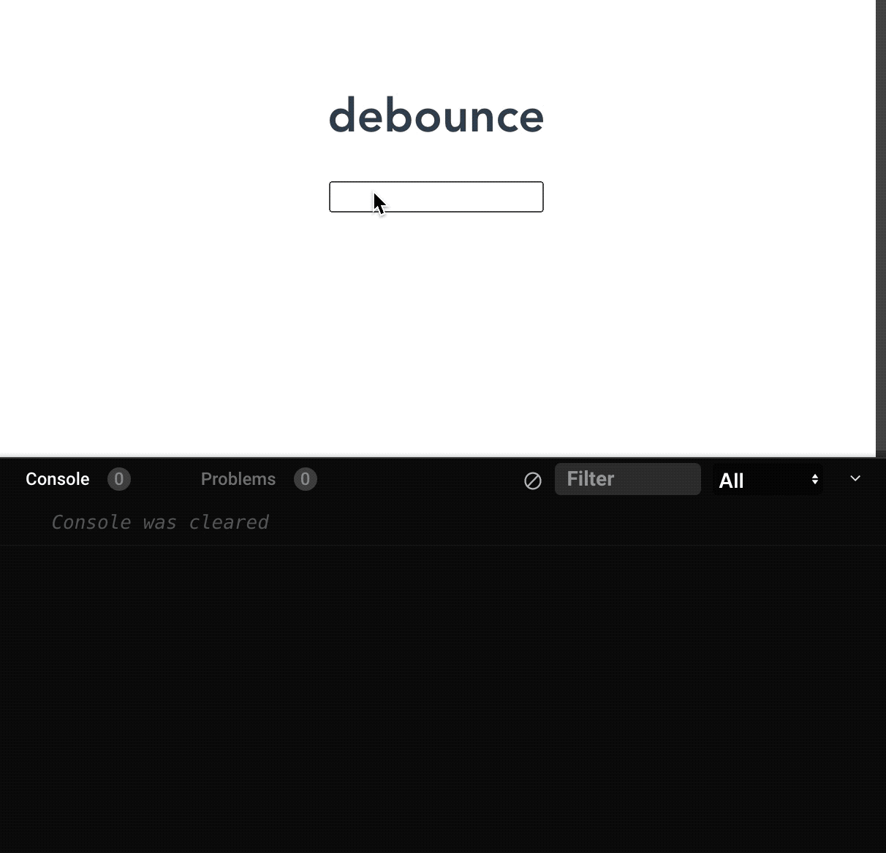
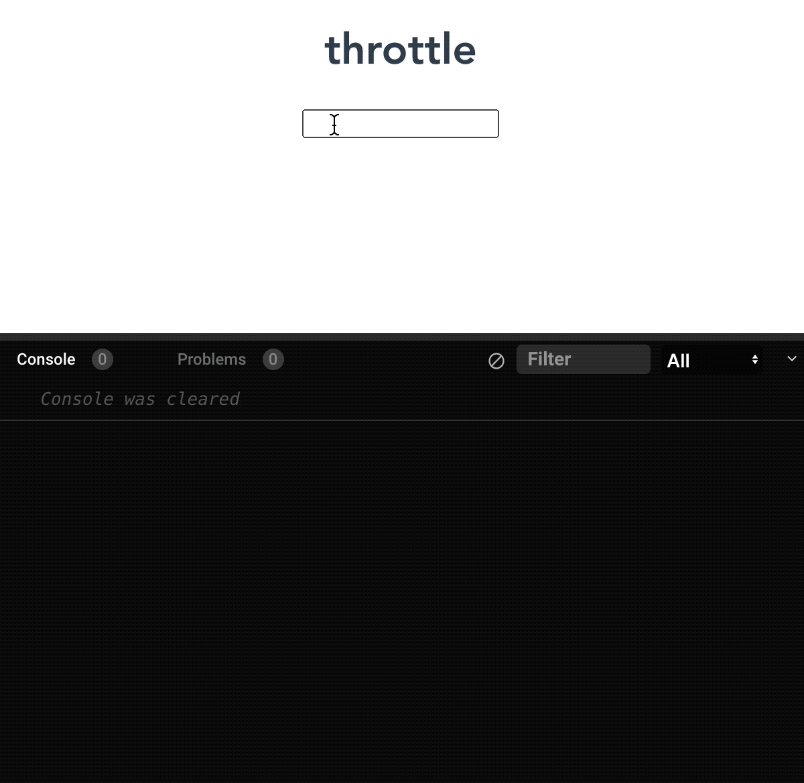

# ✋🏻手撸代码

## 1. 数据扁平化

将一个多维数组变为一个以为数组

```javascript
const arr = [1, [2, [3, [4, 5]]], 6]
// =>  [1, 2, 3, 4, 5, 6]
```

### 方法

<CodeGroup>
  <CodeGroupItem title="FLAT">

```js
const res1 = arr.flat(Infinity)
// Array.prototype.flat(depth) 方法会按照一个可指定的深度（depth：默认值为 1）递归遍历数组，并将所有元素与遍历到的子数组中的元素合并为一个新数组返回。
```

  </CodeGroupItem>

  <CodeGroupItem title="REG" active>

```js
const res2 = JSON.stringify(arr).replace(/\[|\]/g, '').split(',')
// => ['1', '2', '3', '4', '5', '6']
// 数组类型都会变为字符串类型
```

  </CodeGroupItem>

  <CodeGroupItem title="REG2" active>

```js
const res3 = JSON.parse('[' + JSON.stringify(arr).replace(/\[|\]/g, '').split(',') +']') 
```

  </CodeGroupItem>

  <CodeGroupItem title="REDUCE" active>

```js
const flatten = arr => {
  return arr.reduce((pre, cur) => {
    return pre.concat(Array.isArray(cur) ? flatten(cur) : cur)
  }, [])
}
const res4 = flatten(arr)
// Array.prototype.reduce() 方法接收一个函数作为累加器，数组中的每个值（从左到右）开始缩减，最终计算为一个值。对空数组时不会执行回调函数
```

  </CodeGroupItem>

  <CodeGroupItem title="递归函数" active>

```js
const res5 = []
const fn = arr => {
  for (let i = 0; i < arr.length; i++) {
    if (Array.isArray(arr[i])) {
      fn(arr[i])
    } else {
      res5.push(arr[i])
    }
  }
}
fn(arr)
```

  </CodeGroupItem>

</CodeGroup>

## 2. 数组去重 <Badge type="danger" text="重要" />

数组去除重复元素

```javascript
const arr = [1, 1, '1', 2, 3, true, true, false, false, true, 'false', 'a', {}, {}]
// => [1, '1', 2, 3, true, false, 'false', 'a', {}, {}]
```

### 方法

<CodeGroup>
  <CodeGroupItem title="SET">

```js
const res1 = Arrat.from(new Set(arr))
// 函数式
const arrUnique1 = arr => [...new Set(arr)]
```

  </CodeGroupItem>

  <CodeGroupItem title="SPLICE" active>

```js
function arrUnique2 (arr) {
  let len = arr.length
  for (let i = 0; i < len; i++) {
    for (let j = i + 1; j < len; j++) {
      if (arr[i] === arr[j]) {
        arr.splice(j, 1)
        len--
        j--
      }
    }
  }
  return arr
}
```

  </CodeGroupItem>

  <CodeGroupItem title="indexOf" active>

```js
function arrUnique3 (arr) {
  const res = []
  for (let i = 0; i < arr.length; i++) {
    if (res.indexOf(arr[i]) === -1) res.push(arr[i])
  }
  return res
}
// Array.prototype.indexOf() 方法用于查找数组成员第一次出现指定字符的位置。
```

  </CodeGroupItem>

  <CodeGroupItem title="INCLUDE" active>

```js
function arrUnique4 (arr) {
  const res = []
  for (let i = 0; i < arr.length; i++) {
    if (!res.includes(arr[i])) res.push(arr[i])
  }
  return res
}
// Array.prototype.includes() 方法用于判断数组是否包含指定的值。
```

  </CodeGroupItem>

  <CodeGroupItem title="FILTER" active>

```js
function arrUnique5 (arr) {
  return arr.filter((item, index) => {
    return arr.indexOf(item) === index
  })
}
// Array.prototype.filter() 方法创建一个新数组，其包含通过所提供函数实现的测试的所有元素。
```

  </CodeGroupItem>

</CodeGroup>

## 3. Debounce （防抖）<Badge type="danger" text="重要" />

::: tip

- 防抖是某一段时间内只执行一次

- 节流是间隔时间执行

  :::

触发高频时间后 n 秒内函数只会执行一次，如果 n 秒内高频时间再次触发，则重新计算时间

```javascript
const debounce = (fn, time) => {
  let timeout = null
  return function () {
    clearTimeout(timeout)
    timeout = setTimeout(() => {
      fn.apply(this, arguments)
    }, time)
  }
}
```

vue 中实战：input 框实时搜索并发送请求展示下拉列表，在连续输入中途停顿时间不超过设定的时间，是不会发送请求，无规律发送（也可以做节流，规定多少时间发送一次请求，有规律发送） [demo](https://codesandbox.io/s/debounce-n7cw6l?file=/src/App.vue)

我们通过使用 观察者（watcher） 监听 `value` 数据属性 来实现了打印日志。但如果你想在 观察者的回调 中加入一个 使用 `value` 作为参数 的 GET 请求，那你应该不会期望太过频繁地发起请求。



```vue
<template>
  <div>
    <input v-model="str" />
  </div>
</template>

<script>
import debounce from '../utils/debounce'

export default {
  name: "HelloWorld",
  data(){
    return {
      str: ''
    }
  },
  watch: {
    str(...args) {
      this.debouncedWatch(...args)
    }
  },
  created () {
    this.debouncedWatch = debounce((newValue, oldValue) => {
      console.log("Value changed: ", newValue)
    }, 1000)
  }
};
</script>
```

## 4. Throttle （节流）<Badge type="danger" text="重要" />

高频时间触发，但 n 秒内只会执行一次，所以节流会稀释函数的执行频率

```javascript
const throttle = (fn, time) => {
  let flag = true
  return function () {
    if (!flag) return
    flag = false
    setTimeout(() => {
      fn.apply(this, arguments)
      flag = true
    }, time)
  }
}
```

Vue 中实战：规定在一个单位时间内，只能触发一次函数。如果这个单位时间内触发多次函数，只有一次生效。[demo](https://codesandbox.io/s/throttle-3p983f?file=/src/App.vue)



```vue
<template>
  <h1>throttle</h1>
  <input v-model="value" />
</template>

<script>
import throttle from './utils/throttle.js'

export default {
  name: "App",
  data() {
    return {
      value: ''
    }
  },
  created () {
    this.throttleWatch = throttle((newValue, oldValue) => {
      console.log('new value', newValue)
    }, 1000)
  },
  watch: {
    value (...args) {
      this.throttleWatch(...args)
    }
  }
};
</script>
```


## 5. 浅拷贝 <Badge type="danger" text="重要" />

浅拷贝指的是一个新的对象对原始对象的属性值进行精确的拷贝，如果拷贝的是基本数据类型，拷贝的就是基本数据类型的值，如果是引用数据类型（对象），拷贝的就是内存地址。如果一个对象的引用内存地址发生改变，另一个对象也会发生变化。

### 方法一：Object.assign()

`Object.assign(target, ...sources)` 方法用于将所有可枚举自有 Property 的值从一个或多个源对象拷贝到目标对象。

```js
let target = {a: 1}
let obj1 = {b: 2}
let obj2 = {c: 3}
Object.assign(target, obj1, obj2)
// => {a: 1, b: 2, c: 3}
```

::: warning

- 如果目标对象和源对象有同名属性，或者多个源对象有同名属性，则后面的属性会覆盖前面的属性
- 如果该函数只有一个参数，当参数为对象时，直接返回该对象；当参数不是对象时，会先将参数转化为对象，然后返回
- 因为 `null` 和 `undefined` 不能转化为对象，所以第一个参数不能为`null` 和 `undefined`，会报错

:::

::: details 点击查看代码

```js
let target = {}
let obj1 = {a: 1, b: 2}
let obj2 = {b: 3, c: 4}
Object.assign(target, obj1, obj2)
// => {a: 1, b: 3, c: 4} 后面的属性会覆盖前面的属性
```

:::

### 方法二： 扩展运算符

使用扩展运算符可以在构造字面量对象的时候，进行属性拷贝。

`let cloneObj = { ...obj }`

```js
let obj = { a: 1, b: { c: 2, d:3 }, e: 4}
let cloneObj = { ...obj }
cloneObj.b.c = 2
// => { a: 1, b: { c: 2, d:3 }, e: 4}
```

### 方法三：数组方法实现浅拷贝

<CodeGroup>
  <CodeGroupItem title="SLICE">

```js
let arr = [1,2,3,4]
let cloneArr = arr.slice()
// => [1, 2, 3, 4]
// slice(start, end) 为数组的一个方法，该方法可以从已有数组中返回选定的元素，并不改变原数组。
// 该方法有两个参数，两个参数都为可选，如都不写则可以实现数组的浅拷贝
```

  </CodeGroupItem>

  <CodeGroupItem title="CONCAT" active>

```js
let arr = [1,2,3,4]
let cloneArr = arr.concat()
// => [1, 2, 3, 4]
// concat() 方法用于合并两个或多个数组。此方法不会更改现有数组，而是返回一个新数组。
```

  </CodeGroupItem>

</CodeGroup>

### 方法四： 手写实现浅拷贝 <Badge type="danger" text="❕" />

```js
function shallowCopy (object) {
  // 判断是否为对象
  if (!object || typeof object !== 'object') return
  
  // 判断对象类型是一维数组还是对象
  let newObj = Array.isArray(object) ? [] : {}
  
  // 遍历 object，并判断是 object 属性才拷贝
  for (let key in object) {
    if (object.hasOwnProperty(key)) {
      newObj[key] = object[key]
    }
  }
  return newObj
}
```


## 6. 深拷贝 <Badge type="danger" text="重要" />

::: tip

- **浅拷贝**：将一个对象的属性值复制到另一个对象，如果有的属性的值为引用类型的话，那么会将这个引用地址复制给对象，因此两个对象会有同一个引用类型引用。浅拷贝可以使用 `Object.assign` 和扩展运算符来实现，拷贝对象为数组的话，可以使用 `Array.slice()`和 `Array.concat()` 实现浅拷贝。
- **深拷贝**：遇到属性值为引用类型的时候，将新建一个引用类型并将对应的值复制给它，因此新对象获得的一个新的引用类型而不是一个原有类型的引用。

:::

### 方法一：使用方法实现

<CodeGroup>
  <CodeGroupItem title="JSON.stringify">

```js
let obj = {
  a: 1,
  b: {
    c: 2,
    d: {
      e: 3
    }
  }
}
let deepClone = JSON.parse(JSON.stringify(obj))
console.log(deepClone)
// => {"a":1,"b":{"c":2,"d":{"e":3}}}
// 原理：利用 JSON.stringify() 将 js 对象序列化（JSON 字符串），在使用 JSON.parse() 来反序列化（还原） js 对象
// JSON.parse() 方法用来解析 JSON 字符串，构造由字符串描述的 JavaScript 值或对象。
// JSON.stringify() 方法是将一个 JavaScript 值（对象或者数组）转换为一个 JSON 字符串
```

  </CodeGroupItem>

  <CodeGroupItem title="loadsh.cloneDeep" active>

```js
var _ = require('lodash');
var obj1 = {
    a: 1,
    b: { f: { g: 1 } },
    c: [1, 2, 3]
};
var obj2 = _.cloneDeep(obj1);
// loadsh 函数库提供 _.cloneDeep 用来做 Deep Copy
```

  </CodeGroupItem>

</CodeGroup>

::: warning

- 使用 `JSON.stringify() `和`JSON.parse() `实现深拷贝，拷贝对象有函数：`undefined`、`symbol`，当使用`JSON.stringify() `进行处理后会消失

:::

::: details 点击查看代码

```js
let obj = {
  a: 1,
  b: undefined
}
let deepClone = JSON.parse(JSON.stringify(obj))
console.log(deepClone)
// => {a: 1}
```

:::

### 方法二：手写实现 <Badge type="danger" text="❕" />

```js
function deepCopy(object) {
  if (!object || typeof object !== 'object') return
  
  let newObj = Array.isArray(object) ? [] : {}
  
  for (let key in object) {
    if (object.hasOwnProperty(key)) {
      newObj[key] = 
        typeof object[key] === 'object' ? deepCopy(object[key]) : object[key]
    }
  }
  return newObj
}
```


## 7. 滚动加载

监听页面滚动事件，分析 `clientHeight`、`scrollTop`、`scrollHeight `三者的属性关系

```javascript
window.addEventListener('scroll', function () {
  const clientHeight = document.documentElement.clientHeight
  const scrollTop = document.documentElement.scrollTop
  const scrollHeight = document.documentElement.scrollHeight
  
  if (clientHeight + scrollTop >= scrollHeight) {
    // 检测到滚动至页面底部，进行后续操作
  }
})
```

## 8. 渲染大数据不卡页面

渲染大数据时，合理使用 createDocumentFragment 和 requestAnimationFrame，将操作切分为一小段一小段执行

```javascript
setTimeout(() => {
  // 数据总数
  const total = 100000
  // 一次加入的数据
  const once = 20
  // 插入所需次数
  const loopCount = Math.ceil( total / once)
  let countOfRender = 0
  const ul = document.querySelector('ul')
  // 添加数据的方法
  function add () {
    const fragment = document.createDocumentFragment()
    for (let i = 0; i < once; i++) {
      const li = document.createElement('li')
      li.innerText = Math.floor(Math.random() * total)
      fragment.appendChild(li)
    }
    ul.appendChild(fragment)
    countOfRender += 1
    loop()
  }
  function loop () {
    if (countOfRender < loopCount) {
      window.requestAnimationFrame(add)
    }
  }
  loop()
}, 0)
```

## 9. 打印页面使用 html 元素

```javascript
const fn = () => {
  return [...new Set([...document.querySelectorAll('*')].map(el => el.tagName))]
}
```

::: warning
Dom 操作返回的是类数组，需要转换数组之后才能调用数组的方法
:::
