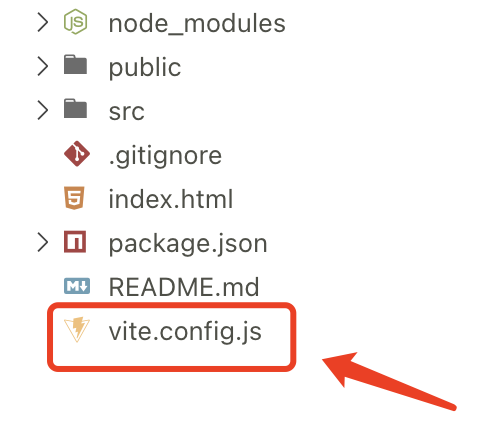

# 配置 Vite

## 配置文件



配置文件位于 `Vite` 项目根目录 `vite.config.js`，初始文件为：

```js
import { defineConfig } from 'vite'
import vue from '@vitejs/plugin-vue'

// https://vitejs.dev/config/
export default defineConfig({
  plugins: [vue()],
})
```

## 初始构建运行

项目初始运行，命令行显示： 

```shell
yarn run v1.22.18
$ vite

  VITE v3.0.0  ready in 332 ms

  ➜  Local:   http://localhost:5173/
  ➜  Network: use --host to expose
```

Network 局域网无法访问，需要在 `vite.config.js` 添加配置：

```js
server: {
  host: '0.0.0.0'
}
```

添加后正常显示：

```shell
下午3:49:14 [vite] server restarted.

  ➜  Local:   http://localhost:5173/
  ➜  Network: http://192.168.1.10:5173/
```

## @ 指向 src

在 `vite.config.js` 中添加配置

```js
import { fileURLToPath, URL } from 'url'

...
resolve: {
  alias: {
    '@': fileURLToPath(new URL('./src', import.meta.url))
  }
},
...
```

