# Vue3

## 一 初识 Vue3

### 1. 介绍 Vue

Vue (读音 /vjuː/，类似于 **view**) 是一套用于构建用户界面的**渐进式框架**。与其它大型框架不同的是，Vue 被设计为可以自底向上逐层应用。Vue 的核心库只关注视图层，不仅易于上手，还便于与第三方库或既有项目整合。另一方面，当与[现代化的工具链](https://cn.vuejs.org/v2/guide/single-file-components.html)以及各种[支持类库](https://github.com/vuejs/awesome-vue#libraries--plugins)结合使用时，Vue 也完全能够为复杂的单页应用提供驱动。

MVVM（Model-View-ViewModel）架构

『View』：视图层（UI 用户界面）
『ViewModel』：业务逻辑层（一切 js 可视为业务逻辑）
『Model』：数据层（存储数据及对数据的处理如增删改查）

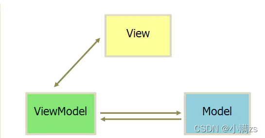

官方文档地址  [介绍 — Vue.js](https://staging-cn.vuejs.org/)

### 2. 回顾vue2 对比 vue3

我们看如下图

发现传统的vue2 逻辑比较分散 可读性差 可维护性差

对比vue3 **逻辑分明** **可维护性高**


### 3. Vue3 新特性介绍

* 重写双向数据绑定
* VDOM 性能瓶颈
* Fragments
* Tree-Shaking 的支持
* Composition API

#### 重写双向数据绑定

```javascript
Vue2 基于 Object.defineProperty() 实现

Vue3 基于 Proxy 

proxy 与 Object.defineProperty(obj, prop, desc) 方式相比有以下优势：
 
// 丢掉麻烦的备份数据
// 省去for in 循环
// 可以监听数组变化
// 代码更简化
// 可以监听动态新增的属性；
// 可以监听删除的属性 ；
// 可以监听数组的索引和 length 属性；
 
let proxyObj = new Proxy(obj,{
    get : function (target,prop) {
        return prop in target ? target[prop] : 0
    },
    set : function (target,prop,value) {
        target[prop] = 888;
    }
})
```

#### Vue3 优化 Vdom

在 Vue2 中,每次更新 diff,都是全量对比,Vue3则只对比带有标记的,这样大大减少了非动态内容的对比消耗

#### Vue3 Fragment

Vue3 允许我们支持多个根节点

```vue
<template>
  <div>1</div>
  <div>2</div>
</template>
```

#### Vue3 Tree Shaking

简单来讲，就是在保持代码运行结果不变的前提下，去除无用的代码

在Vue2中，无论我们使用什么功能，它们最终都会出现在生产代码中。主要原因是Vue实例在项目中是单例的，捆绑程序无法检测到该对象的哪些属性在代码中被使用到

而Vue3源码引入tree shaking特性，将全局 API 进行分块。如果你不使用其某些功能，它们将不会包含在你的基础包中

就是比如你要用watch 就是import {watch} from 'vue' 其他的computed 没用到就不会给你打包减少体积

#### Vue3 Composition API

Setup 函数式编程 也叫 Vue Hook

## 二 配置环境

### 1. 安装 node.js 

[下载 | Node.js](https://nodejs.org/en/)

检查安装

```shell
[root@tc ~]# npm -v
8.5.5
```

### 2. 构建 vite 项目

[官网 | Vite](https://vitejs.cn/guide/#overview)

Vite（法语意为 "快速的"，发音 `/vit/`，发音同 "veet")是一种新型前端构建工具，能够显著提升前端开发体验。它主要由两部分组成：

* 一个开发服务器，它基于 [原生 ES 模块](https://developer.mozilla.org/en-US/docs/Web/JavaScript/Guide/Modules) 提供了 [丰富的内建功能](https://vitejs.cn/guide/features.html)，如速度快到惊人的 [模块热更新（HMR）](https://vitejs.cn/guide/features.html#hot-module-replacement)。
* 一套构建指令，它使用 [Rollup](https://rollupjs.org/) 打包你的代码，并且它是预配置的，可输出用于生产环境的高度优化过的静态资源。

Vite 意在提供开箱即用的配置，同时它的 [插件 API](https://vitejs.cn/guide/api-plugin.html) 和 [JavaScript API](https://vitejs.cn/guide/api-javascript.html) 带来了高度的可扩展性，并有完整的类型支持。

使用 vite 初始化一个项目

npm

```shell
npm init vite@latest
```

**package.json** 解析

```json
{
  "scripts": {
    "dev": "vite",	// 启动开发服务器, 别名 vite dev, vite serve
    "build": "vue-tsc --noEmit && vite build", // 为生产环境构建产物
    "preview": "vite preview"	// 本地预览生产构建产物
  }
}
```

## 三 Vite 目录 & Vue 单文件组件

### 1. Vite 目录

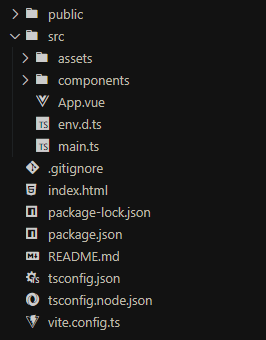

* public 下面不会被编译,可以存放静态资源
* assets 下面可以存放可编译的静态资源
* components 下面用来存放组件
* App.vue 是全局组件
* main.ts 全局 ts 文件
* index.html 非常重要的入口文件 （webpack，rollup 他们的入口文件都是 enrty input 是一个js文件 而Vite 的入口文件是一个 html 文件，他刚开始不会编译这些js文件 只有当你用到的时候 如 script src="xxxxx.js" 会发起一个请求被 vite 拦截这时候才会解析 js 文件
* vite.config.ts 这是 vite 的配置文件具体配置项
* Volar VsCode Vue3 推荐插件

### 2. SFC 语法规范

*.vue 由三种类型的顶层语法块所组成: `<template> <script> <style>`

```vue
<template>
  每个 *.vue 文件最多可同时包含一个顶层 <template> 块
      
  其中内容会被提取出来传递给 @vue/compiler-dom, 预编译为 javasrcipt 的渲染函数,并附属到导出的组件上作为其 render 选线
</template>

<script>
  每一个 *.vue 文件最多可同时包含一个 <script> 块 (不包括<script setup>)。

  该脚本将作为 ES Module 来执行。

  其默认导出的内容应该是 Vue 组件选项对象，它要么是一个普通的对象，要么是 defineComponent 的返回值。
</script>

< script setup>
  每个 *.vue 文件最多可同时包含一个 <script setup> 块 (不包括常规的 <script>)

  该脚本会被预处理并作为组件的 setup() 函数使用，也就是说它会在每个组件实例中执行。<script setup> 的顶层绑定会自动暴露给模板。更多详情请查看 <script setup> 文档。https://v3.cn.vuejs.org/api/sfc-script-setup
</script>

<style>
  一个 *.vue 文件可以包含多个 <style> 标签。

  <style> 标签可以通过 scoped 或 module attribute (更多详情请查看 SFC 样式特性https://v3.cn.vuejs.org/api/sfc-style) 将样式封装在当前组件内。多个不同封装模式的 <style> 标签可以在同一个组件中混
</style>
```

## 四 模板语法 & Vue 指令

### 1. 模板语法

在 script 声明一个变量可以直接在 template 使用用法为 {{ 变量名称 }}

```vue
<template>
  <h1>{{ message }}</h1>
</template>

<script setup lang="ts">

const message: string = 'Hello World!'

</script>
```

模板语法是可以编写条件运算

```vue
<template>
  <h1>{{ message ? 'True' : 'False' }}</h1>
</template>

<script setup lang="ts">

const message: boolean = false

</script>
```

运算

```vue
<template>
  <h1>{{ message + 1 }}</h1>
</template>

<script setup lang="ts">

const message: number = 1

</script>
```

操作 API

```vue
<template>
  <h1>{{ message.split(' ') }}</h1>
</template>

<script setup lang="ts">

const message: string = 'Hello World!'

</script>
```

### 2. Vue 指令

**v-** 开头的都是 Vue 的指令

#### v-text

显示文本

```vue
<template>
  <h1 v-text="message"></h1>
</template>

<script setup lang="ts">

const message: string = 'Hello World!'

</script>
```

#### v-html

显示带标签的文本

```vue
<template>
  <div v-html="message"></div>
</template>

<script setup lang="ts">

const message: string = '<h1>Hello World!<h1>'

</script>
```

#### v-if 

隐藏和显示

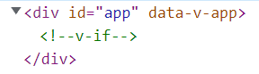

```vue
<template>
  <div v-if="message">我是隐藏的</div>
</template>

<script setup lang="ts">

const message: boolean = false

</script>
```

#### v-show

隐藏和显示

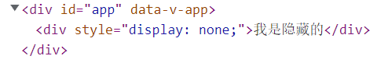

```vue
<template>
  <div v-show="message">我是隐藏的</div>
</template>

<script setup lang="ts">

const message: boolean = false

</script>
```

#### v-else-if

条件判断显示

```VUE
<template>
  <div v-if="message === 'A' ">A</div>
  <div v-else-if="message === 'B'">B</div>
  <div v-else-if="message === 'C'">C</div>
  <div v-else="message === 'D'">D</div>
</template>

<script setup lang="ts">

const message: string = 'B'

</script>
```

#### v-on 

[官网 | 事件处理](https://staging-cn.vuejs.org/guide/essentials/event-handling.html)

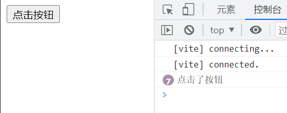

```vue
<template>
  // 简写模式 @click
  <button @click="clickButton">点击按钮</button>
</template>

<script setup lang="ts">

const clickButton = () => {
  console.log('点击了按钮')
}

</script>
```

支持冒泡

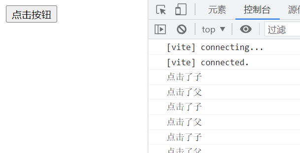

```vue
<template>
  <div @click="clickParent">
    <button @click="clickChild">点击按钮</button>
  </div>
</template>

<script setup lang="ts">

const clickParent = () => {
  console.log('点击了父')
}

const clickChild = () => {
  console.log('点击了子')
}

</script>
```

关闭冒泡

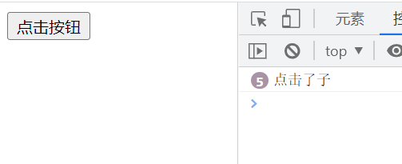

```vue
<template>
  <div @click="clickParent">
    // @click.stop 关闭冒泡
    <button @click.stop="clickChild">点击按钮</button>
  </div>
</template>

<script setup lang="ts">

const clickParent = () => {
  console.log('点击了父')
}

const clickChild = () => {
  console.log('点击了子')
}

</script>
```

**事件修饰符**

```html
<!-- 单击事件将停止传递 -->
<a @click.stop="doThis"></a>

<!-- 提交事件将不再重新加载页面 -->
<form @submit.prevent="onSubmit"></form>

<!-- 修饰语可以使用链式书写 -->
<a @click.stop.prevent="doThat"></a>

<!-- 也可以只有修饰符 -->
<form @submit.prevent></form>

<!-- 仅当 event.target 是元素本身时才会触发事件处理器 -->
<!-- 例如：事件处理器不来自子元素 -->
<div @click.self="doThat">...</div>
```

#### v-for

循环遍历

```vue
<template>
  <h1 v-for="item in arr" :key="item">{{ item }}</h1>
</template>

<script setup lang="ts">

const arr: Array<number> = [1,2,3,4,5]

</script>
```

#### v-model

双向绑定

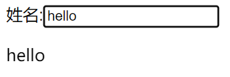

```vue
<template>
  <span>姓名:</span><input v-model="text">
  <p>{{ text }}</p>
</template>

<script setup lang="ts">
import { ref } from 'vue'

const text = ref('hello')

</script>
```

## 五 Vue 核心虚拟 Dom & diff 算法

### 1. 介绍虚拟 Dom

虚拟 **DOM** 就是通过JS来生成一个AST节点树


```vue
<div>
    <div> 
         <section>test</section>
      </div>  
</div>

<script>
import { createElementVNode as _createElementVNode, openBlock as _openBlock, createElementBlock as _createElementBlock } from "vue"

export function render(_ctx, _cache, $props, $setup, $data, $options) {
  return (_openBlock(), _createElementBlock("div", null, [
    _createElementVNode("div", null, [
      _createElementVNode("section", null, "test")
    ])
  ]))
}

// Check the console for the AST
</script>
```

[Vue Template Explorer](https://vue-next-template-explorer.netlify.app/#eyJzcmMiOiI8ZGl2PlxyXG4gICAgPGRpdj4gXHJcbiAgICAgICAgIDxzZWN0aW9uPnRlc3Q8L3NlY3Rpb24+XHJcbiAgICAgIDwvZGl2PiAgXHJcbjwvZGl2PiIsIm9wdGlvbnMiOnt9fQ==)

**为什么要有虚拟 DOM？**

打印出 DOM 属性， 发现 DOM 上面的属性非常多。 直接操作 DOM 非常浪费性能

```javascript
let div = document.createElement('div')
let str = ''
for (const key in div) {
  str += key + ''
}
console.log(str)
```

解决方案就是用 js 的计算性能来换取操作 DOM 所消耗的性能，既然我们逃不掉操作 DOM 这道坎，但是我们可以尽可能少的操作 DOM 操作JS是非常快的

### 2. 介绍 Diff 算法

## 六 Ref

接受一个内部值并返回一个响应式且可变的 ref 对象。ref 对象仅有一个 `.value` property，指向该内部值。

### 1. ref Ref

案例

不是响应式数值

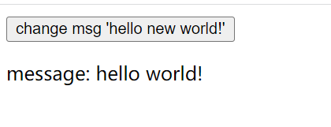

```vue
<template>
  <button @click="changeMsg">change msg 'hello new world!'</button>
  <p>message: {{ message }}</p>
</template>

<script setup lang="ts">

let message:string = 'hello world!'

const changeMsg = () => {
  message = 'hello new world!'
}

</script>
```

改成 ref

Ref ts 对应的接口

```typescript
interface Ref<T> {
  value: T
}
```

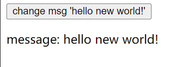

注意被 ref 包装之后需要 .value 来进行赋值

```vue
<template>
  <button @click="changeMsg">change msg 'hello new world!'</button>
  <p>message: {{ message }}</p>
</template>

<script setup lang="ts">
import { ref, Ref } from 'vue'

let message:Ref<string> = ref('hello world!')

const changeMsg = () => {
  message.value = 'hello new world!'
}

</script>
```

### 2. isRef

判断是否为一个 ref 对象

```typescript
import { ref, Ref, isRef } from 'vue'

let message:Ref<string | number> = ref('hello world!')

let notRef:number = 123

const printIsRef = () => {
    console.log(isRef(message)) // true
    console.log(isRef(notRef))  // false
}
```

### 3. shallowRef

创建一个跟踪自身 `.value` 变化的 ref，但不会使其值也变成响应式的

例子

修改其属性是非响应式的这样是不会改变的

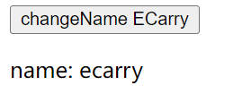

```vue
<template>
  <button @click="changeName">changeName</button>
  <p>name: {{ info.name }}</p>
</template>

<script setup lang="ts">
import { Ref, shallowRef } from 'vue'

type Obj = {
  name: string
}

let info:Ref<Obj> = shallowRef({
  name: 'ecarry'
})

const changeName = () => {
  info.value.name = 'ECarry'
}

</script>
```

例子2

这样是可以被监听到的修改 value

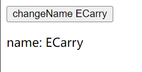

```vue
<template>
  <button @click="changeName">changeName ECarry</button>
  <p>name: {{ info.name }}</p>
</template>

<script setup lang="ts">
import { Ref, shallowRef } from 'vue'

type Obj = {
  name: string
}

let info:Ref<Obj> = shallowRef({
  name: 'ecarry'
})

const changeName = () => {
  info.value = {
    name: 'ECarry'
  }
}

</script>
```

### 4. triggerRef

强制更新页面 Dom，也能改变值


```vue
<template>
  <button @click="changeName">changeName ECarry</button>
  <p>name: {{ info.name }}</p>
</template>

<script setup lang="ts">
import { Ref, shallowRef, triggerRef } from 'vue'

type Obj = {
  name: string
}

let info:Ref<Obj> = shallowRef({
  name: 'ecarry'
})

const changeName = () => {
  info.value.name = 'ECarry'
  triggerRef(info)
}
```

### 5. customRef

自定义 ref

**customRef** 是个工厂函数要求我们返回一个对象 并且实现 **get** 和 **set**


```vue
<template>
  <button @click="changeName">changeName ECarry</button>
  <p>name: {{ name }}</p>
</template>

<script setup lang="ts">
import { customRef } from 'vue'

function MyRef<T>(value: T) {
  return customRef((track, trigger) => {
    return {
      get() {
        track()
        return value
      },
      set(newValue: T) {
        console.log('set')
        value = newValue
        trigger()
      }
    }
  })
}

let name = MyRef<string>('ecarry')

const changeName = () => {
  name.value = 'ECarry'
}

</script>
```

## 七 Reactive

### 1. 什么是 reactive

用来绑定复杂的数据类型 例如 **对象** **数组**

reactive 源码约束了我们的数据类型

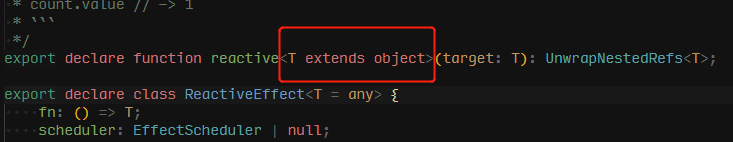

绑定普通数据类型会报错

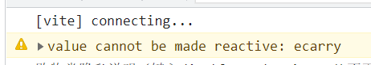

```vue
<template>
  <p>name: {{ name }}</p>
</template>

<script setup lang="ts">
import { reactive } from 'vue'

const name = reactive('ecarry')

</script>
```

### 2.  基础用法

```vue
<template>
  <p>name: {{ info.name }}</p>
</template>

<script setup lang="ts">
import { reactive } from 'vue'

const info = reactive({
  name: 'ecarry'
})

</script>
```

### 3. 数组异步赋值问题

这样赋值页面是不会变化的因为会脱离响应式

```javascript
let person = reactive<number[]>([])

setTimeout(() => {
  person = [1, 2, 3]
  console.log(person);
},1000)
```

解决方案1

使用 push

```javascript
import { reactive } from 'vue'

let person = reactive<number[]>([])

setTimeout(() => {
  const arr = [1, 2, 3]
  person.push(...arr)
  console.log(person);
},1000)
```

解决方案2

包裹一层对象

```javascript
import { reactive } from 'vue'

type Person = {
  list?:Array<number>
}

let person = reactive<Person>({
   list:[]
})

setTimeout(() => {
  const arr = [1, 2, 3]
  person.list = arr;
  console.log(person);
},1000)
```

### 4. readonly

拷贝一份 **proxy** 对象将其设置为只读

```javascript
import { reactive, readonly} from 'vue'

const person = reactive({count:1})

const copy = readonly(person)
 
 //person.count++
 
 copy.count++
```

### 5. shallowReactive 

只能对浅层的数据 如果是深层的数据只会改变值 不会改变视图

```vue
<template>
  <div>
    <div>{{ state }}</div>
    <button @click="change1">test1</button>
    <button @click="change2">test2</button>
  </div>
</template>
 
 
 
<script setup lang="ts">
import { shallowReactive } from 'vue'
 
const obj = {
  a: 1,
  first: {
    b: 2,
    second: {
      c: 3
    }
  }
}
 
const state = shallowReactive(obj)
 
function change1() {
  state.a = 7
}
function change2() {
  state.first.b = 8
  state.first.second.c = 9
  console.log(state);
}
 
</script> 

```

## 七 认识 to 全家桶

### 1. toRef

如果原始对象是非响应式的就不会更新视图 数据是会变的

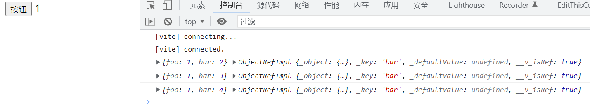

```vue
<template>
   <div>
      <button @click="change">按钮</button>
      {{state}}
   </div>
</template>
 
<script setup lang="ts">
import { reactive, toRef } from 'vue'
 
const obj = {
   foo: 1,
   bar: 1
}
 
 
const state = toRef(obj, 'bar')
// bar 转化为响应式对象
 
const change = () => {
   state.value++
   console.log(obj, state);
 
}
</script>
```

如果原始对象是响应式的是会更新视图并且改变数据的

### 2. toRefs

可以帮我们批量创建 ref 对象主要是方便我们解构使用

```vue
<template>
   <div>
      foo {{ foo }} bar {{ bar }}
   </div>
</template>
 
<script setup lang="ts">
import { reactive, toRefs } from 'vue'
const obj = reactive({
   foo: 1,
   bar: 1
})
 
let { foo, bar } = toRefs(obj)
 
foo.value++
console.log(foo, bar);
</script>
```

### 3. toRaw

将响应式对象转化为普通对象

```vue
<template>
   <div>
      <button @click="change">按钮</button>
   </div>
</template>
 
<script setup lang="ts">
import { reactive, toRaw } from 'vue'
 
const obj = reactive({
   foo: 1,
   bar: 1
})
 
 
const state = toRaw(obj)
// 响应式对象转化为普通对象
 
const change = () => {
 
   console.log(obj, state);
 
}
</script>
```

## 八 Computed 计算属性

计算属性就是当依赖的属性的值发生变化的时候，才会触发他的更改，如果依赖的值，不发生变化的时候，使用的是缓存中的属性值。

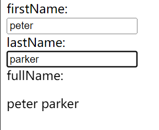

```vue
<template>
   <div>
     firstName: <input v-model="firstName">
     lastName: <input v-model="lastName">
     fullName:<p>{{ fullName }}</p>
   </div>
</template>
 
<script setup lang="ts">
import { ref, computed } from 'vue'
 
const firstName = ref('')
const lastName = ref('')

const fullName = computed(() => {
  return firstName.value + ' ' + lastName.value
})
</script>
```

## 九 Watch 监听器

`watch` 需要侦听特定的数据源，并在单独的回调函数中执行副作用

```javascript
import { watch } from 'vue'

watch([第一个参数：需要监听的数据], (第二个参数：回调函数 newVal, oldValue) => {}, {
    第三个参数：一个options配置项
  immediate:true //是否立即调用一次

  deep:true //是否开启深度监听    
})
```

### 1.  监听 ref

基本数据类型

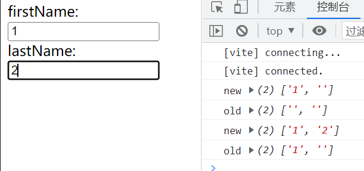

```vue
<template>
   <div>
     firstName: <input v-model="firstName">
     lastName: <input v-model="lastName">
   </div>
</template>
 
<script setup lang="ts">
import { ref, watch } from 'vue'
 
const firstName = ref('')
const lastName = ref('')

watch([firstName, lastName], (newVal, oldVal) => {
  console.log('new', newVal)
  console.log('old', oldVal)
})
</script>
```

监听 ref 数组类型，需要开启深度监听 deep

```vue
<template>
   <div>
     firstName: <input v-model="userInfo.fullName.firstName">
     lastName: <input v-model="userInfo.fullName.lastName">
   </div>
</template>
 
<script setup lang="ts">
import { ref, watch } from 'vue'
 
const userInfo = ref({
  fullName: {
    firstName: '',
    lastName: ''
  }
})

watch(userInfo, (newVal, oldVal) => {
  console.log('new', newVal)
  console.log('old', oldVal)
},{
  deep: true
})
</script>
```

### 2.  reactive

使用reactive监听深层对象开启和不开启deep 效果一样

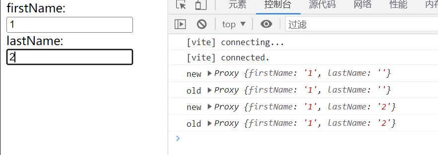

```vue
<template>
   <div>
     firstName: <input v-model="userInfo.firstName">
     lastName: <input v-model="userInfo.lastName">
   </div>
</template>
 
<script setup lang="ts">
import { reactive, watch } from 'vue'
 
const userInfo = reactive({
  firstName: '',
  lastName: ''
})

watch(userInfo, (newVal, oldVal) => {
  console.log('new', newVal)
  console.log('old', oldVal)
},{
  // deep: true 可以不开启也能监听
})
</script>
```

监听单个 reactive 值

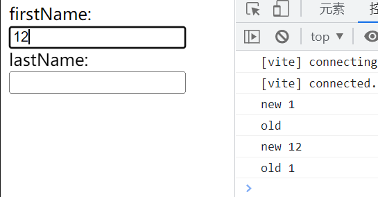

```vue
<template>
   <div>
     firstName: <input v-model="userInfo.firstName">
     lastName: <input v-model="userInfo.lastName">
   </div>
</template>
 
<script setup lang="ts">
import { reactive, watch } from 'vue'
 
const userInfo = reactive({
  firstName: '',
  lastName: ''
})

watch(() => userInfo.firstName, (newVal, oldVal) => {
  console.log('new', newVal)
  console.log('old', oldVal)
})
</script>
```

## 十 watchEffect

立即执行传入的一个函数，同时响应式追踪其依赖，并在其依赖变更时重新运行该函数。

如果用到 message 就只会监听 message 就是用到几个监听几个 而且是非惰性 会默认调用一次

```typescript
let message = ref<string>('')
let message2 = ref<string>('')
 watchEffect(() => {
    //console.log('message', message.value);
    console.log('message2', message2.value);
})
```

### 1. 清除副作用

就是在触发监听之前会调用一个函数可以处理你的逻辑

例如防抖

```typescript
import { watchEffect, ref } from 'vue'
let message = ref<string>('')
let message2 = ref<string>('')
watchEffect((oninvalidate) => {
    //console.log('message', message.value);
    oninvalidate(()=>{
        
    })
    console.log('message2', message2.value);
})
```

停止跟踪 watchEffect 返回一个函数 调用之后将停止更新

```typescript
const stop =  watchEffect((oninvalidate) => {
    //console.log('message', message.value);
    oninvalidate(()=>{
 
    })
    console.log('message2', message2.value);
},{
    flush:"post",
    onTrigger () {
 
    }
})
stop()
```

## 十一 组件 & 生命周期

### 1. 组件

组件允许我们将 UI 划分为独立的、可重用的部分来思考。组件在应用程序中常常被组织成层层嵌套的树状结构：


### 2. 组件生命周期


## 十二 组件间传值

### 1. 父组件向子组件传值

v-bind

父组件

```vue

<template>
   <Son :value="value"></Son>
</template>
 
<script setup lang="ts">
import { reactive, watch } from 'vue'
import Son from './components/Son.vue'
 
const value:string = '父组件传过来的值'
</script>
```

子组件

```vue
<template>
   <h1>{{ value }}</h1>
</template>
 
<script setup lang="ts">
type Props = {
  value: string
}

defineProps<Props>()
</script>
```

### 2. 子组件向父组件传值

#### 通过 defineEmits 派发一个事件

子组件

```vue
<template>
  <button @click="clickTap">发送数据给父组件</button>
</template>
 
<script setup lang="ts">

const value:string = '我是子组件传递过来的值'
const emit = defineEmits(['click'])

const clickTap = () => {
  emit('click', value)
}
</script>
```

父组件

```vue
<template>
   <Son @click="getVal"></Son>
</template>
 
<script setup lang="ts">
import Son from './components/Son.vue'
 
const getVal = (value: string) => {
  console.log(value)
}
</script>
```

#### 通过 defineExpose 获取数据

子组件

```vue
<template>

</template>
 
<script setup lang="ts">
import { reactive } from 'vue';

const menus = reactive<number[]>([1,2,3,4,5])

defineExpose({
  menus
})
</script>
```

父组件

```vue
<template>
   <Son ref="menus"></Son>
   <button @click="getValue">获取子组件ref数据</button>
</template>
 
<script setup lang="ts">
import { ref } from 'vue'
import Son from './components/Son.vue'
 
const menus = ref(null)

const getValue = () => {
  console.log(menus.value)
}

</script>
```

## 十三 全局、局部、递归组件

### 1. 全局组件

## 十四 动态组件

## 十五 插槽 slot

插槽就是子组件中的提供给父组件使用的一个占位符，用 `<slot></slot>` 表示，父组件可以在这个占位符中填充任何模板代码，如 HTML、组件等，填充的内容会替换子组件的 `<slot></slot>` 标签。

### 1. 匿名插槽

在子组件放置一个插槽

```vue
<template>
  <slot></slot>
</template>
```

父组件使用插槽，在父组件给这个插槽填充内容

```vue
<script setup lang="ts">
import Son from './components/Son.vue'

</script>

<template>
  <Son>
    <template v-slot>
      123
    </template>
  </Son>
</template>
```

## 十六 异步组件 & 代码分包 & suspense

## 十七 Teleport 传送组件

`Teleport` 是一种能够将我们的模板渲染至指定`DOM`节点，不受父级`style`、`v-show`等属性影响，但`data`、`prop`数据依旧能够共用的技术；类似于 `React` 的 `Portal`。

## 十八 keep-alive  缓存组件

有时候我们不希望组件被重新渲染影响使用体验；或者处于性能考虑，避免多次重复渲染降低性能。而是希望组件可以缓存下来，维持当前的状态。这时候就需要用到`keep-alive`组件。

开启keep-alive 生命周期的变化

* 初次进入时： onMounted> onActivated
* 退出后触发 deactivated
* 再次进入：
* 只会触发 onActivated
* 事件挂载的方法等，只执行一次的放在 onMounted 中；组件每次进去执行的方法放在 onActivated中

### 1. 基础用法

登录注册组件切换填写的信息不会被销毁

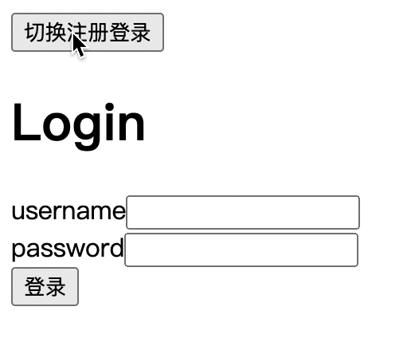

```vue
<template>
  <div>
    <button @click="changeLogin">切换注册登录</button>
    <keep-alive>
      <Login v-if="flag"></Login>
      <Register v-else></Register>
    </keep-alive>
  </div>
</template>
```

没有 keep-alive ，组件生命周期变化

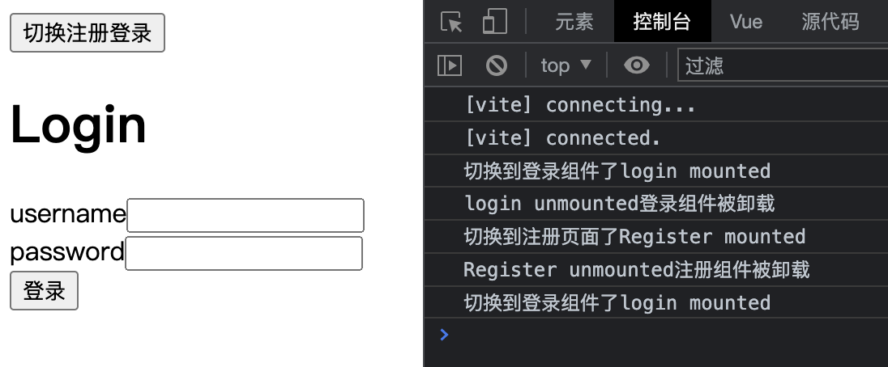

有 keep-alive ，组件生命周期变化

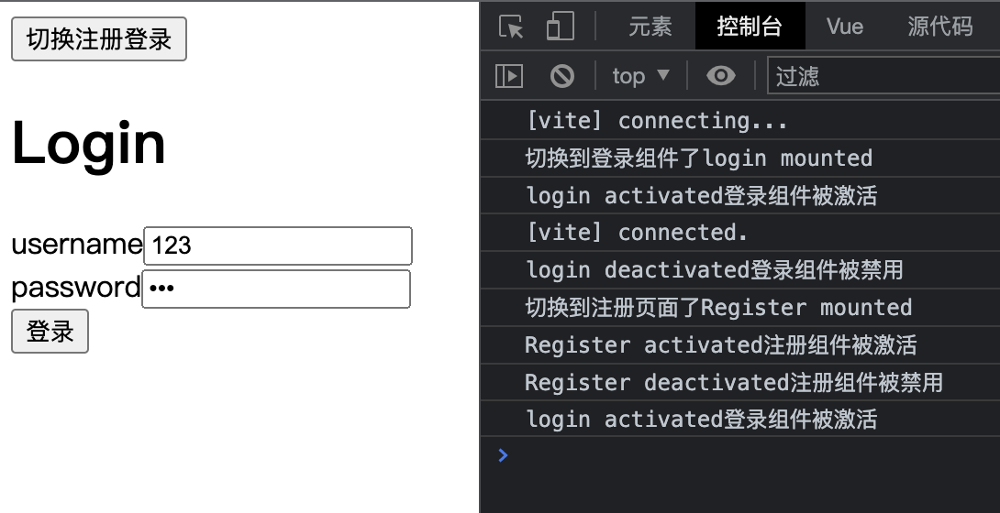

### 2. include & exclude

include 和 exclude prop 允许组件有条件地缓存。二者都可以用逗号分隔字符串、正则表达式或一个数组来表示

`<keep-alive :exclude="[]" :include="[]"></keep-alive>`

```vue
<!-- 以英文逗号分隔的字符串 -->
<KeepAlive include="a,b">
  <component :is="view" />
</KeepAlive>

<!-- 正则表达式 (需使用 `v-bind`) -->
<KeepAlive :include="/a|b/">
  <component :is="view" />
</KeepAlive>

<!-- 数组 (需使用 `v-bind`) -->
<KeepAlive :include="['a', 'b']">
  <component :is="view" />
</KeepAlive>
```

### 3. 最大缓存实例数 max

我们可以通过传入 `max` prop 来限制可被缓存的最大组件实例数。`<KeepAlive>` 的行为在指定了 `max` 后类似一个 [LRU 缓存](https://en.wikipedia.org/wiki/Cache_replacement_policies#Least_recently_used_(LRU))：如果缓存的实例数量即将超过指定的那个最大数量，则最久没有被访问的缓存实例将被销毁，以便为新的实例腾出空间。

```vue
<KeepAlive :max="10">
  <component :is="activeComponent" />
</KeepAlive>
```

## 十九 Transition 动画组件

## 二十 依赖注入 Provide & Inject

## 二一 兄弟组件传值 Bus

### 1. 借助父组件传参数

```vue
<template>
  <A @on-click="getFlag"/>
  <B :flag="Flag"/>
</template>

<script setup lang="ts">
  import A from './components/A.vue'
  import B from './components/B.vue'
  import { ref } from 'vue'
  
  let Flag = ref<boolean>(false)
  const getFlag = (flag: boolean) => {
    Flag.value = flag
  }
</script>
```

### 2. Event Bus

## 二二 Mitt
